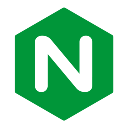
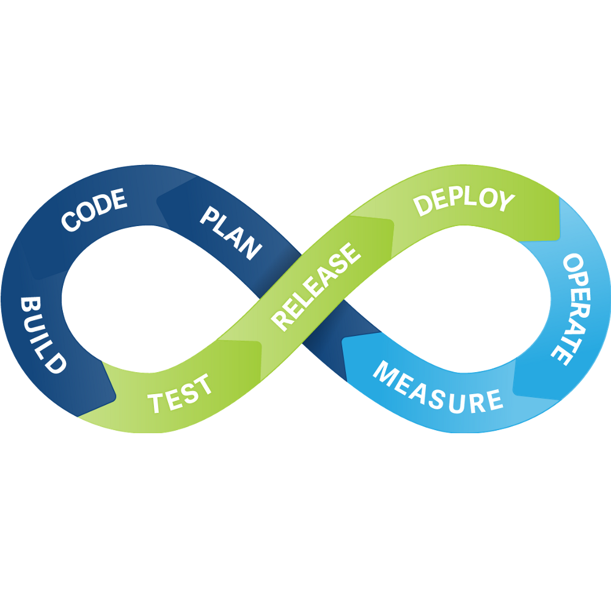

# 👋 Hi, I’m Shahriyor (@pyfullstackdev)

----------------------------------------

## About me

- 🔭 I'm currently working on **Open-Source Projects, Scalable Web-Apps**
- 🧠 I’m interested in **Coding, Listening Music, Playing Chess, Reading Book**
- 🌱 I’m currently learning **Django, FastAPI, Flask, React.js, Next.js, Vue.js, Nuxt.js**
- 🧑‍💻️ I code with **Python, SQL, HTML5, CSS3, JavaScript, TypeScript**
- 💬 Ask me about **Python, PostgreSQL, Django, FastAPI, Flask, JavaScript, TypeScript, React.js, Next.js, Vue.js, Nuxt.js, Docker**
- 💞️ I'm looking to collaborate as **Middle Full-Stack Developer**
- 📫 How to reach me [sh.baxtiyorov.2004@gmail.com](mailto:sh.baxtiyorov.2004@gmail.com)
- ⚡ Fun fact: Did you know that Python was named after the British comedy group Monty Python? Guido van Rossum, the
  creator of Python, was a big fan of their TV show.

### Backend

### Frontend

### Databases

### DevOps

